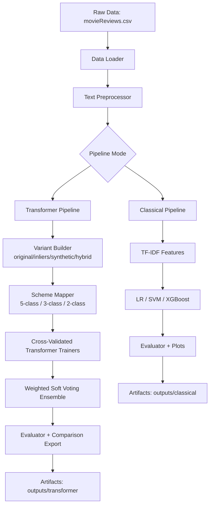

# Movie Sentiment Intelligence Platform

<p align="center">
  <strong>From exploratory notebooks to an industry-grade OOP repository</strong><br/>
  <em>Classical ML baselines + advanced transformer ensembling for phrase-level sentiment.</em>
</p>

<p align="center">
  
  
  
  
</p>

---

## The Story

This project started as two large, high-velocity notebooks:

- `MovieSentimentAnalysis (1).ipynb`: broad experimental sweep (EDA, cleaning, TF-IDF, embedding models, deep models).
- `MovieSentimentAnalysis_AdvancedKagglePipeline.ipynb`: aggressive leaderboard-oriented transformer workflow (CV, ensemble weighting, scheme comparisons).

Those notebooks proved the ideas. This repository makes them **repeatable, testable, and extensible**.

### What changed in this refactor

1. Notebook logic was migrated into a modular OOP package under `src/movie_sentiment`.
2. Reusable components were introduced for data loading, preprocessing, augmentation, vectorization, model training, and evaluation.
3. Notebook entry points were redesigned as lightweight orchestrators that call package code.
4. Script-based execution was added for CI/CD and automation.
5. Outputs are consistently exported to structured artifact folders.

---

## Result Snapshot

A prior run of the advanced stack (from your existing artifacts) indicates strong performance:

- **Advanced Transformer Ensemble [two] on hybrid_augmented**
  - Accuracy: `0.9224`
  - Macro F1: `0.9208`
- **Advanced Transformer Ensemble [five] on hybrid_augmented**
  - Accuracy: `0.8215`
  - Macro F1: `0.8165`

This refactored repository preserves those workflows while making future iterations far easier to scale.

---

## Architecture



---

## Repository Layout

```text
DSAI/
├── src/movie_sentiment/
│   ├── config.py
│   ├── data/
│   │   ├── loader.py
│   │   ├── preprocessing.py
│   │   ├── augmentation.py
│   │   └── schemes.py
│   ├── features/
│   │   └── vectorizers.py
│   ├── models/
│   │   ├── base.py
│   │   ├── classical.py
│   │   ├── neural.py
│   │   └── transformer.py
│   ├── evaluation/
│   │   ├── metrics.py
│   │   └── plots.py
│   ├── pipelines/
│   │   ├── classical_pipeline.py
│   │   └── transformer_pipeline.py
│   └── utils/
│       ├── io.py
│       └── seed.py
├── notebooks/
│   ├── 01_ClassicalPipeline_OOP.ipynb
│   └── 02_TransformerEnsemble_OOP.ipynb
├── scripts/
│   ├── run_classical_pipeline.py
│   └── run_transformer_pipeline.py
├── tests/
│   ├── test_preprocessing.py
│   └── test_schemes.py
├── requirements.txt
├── pyproject.toml
└── README.md
```

---

## Quick Start

### 1) Create environment and install dependencies

```bash
python -m venv .venv
# Windows PowerShell
.\.venv\Scripts\Activate.ps1
pip install -r requirements.txt
```

### 2) Run classical benchmark pipeline

```bash
python scripts/run_classical_pipeline.py --output-dir outputs
```

### 3) Run transformer ensemble pipeline

```bash
python scripts/run_transformer_pipeline.py --output-dir outputs --variant hybrid_augmented --schemes five,three,two
```

### 4) Run tests

```bash
pytest -q
```

---

## Notebook Entry Points

Use the new notebook frontends for analyst-friendly workflows while still keeping production-grade structure:

- `MovieSentimentAnalysis (1).ipynb` (refactored orchestrator)
- `MovieSentimentAnalysis_AdvancedKagglePipeline.ipynb` (refactored orchestrator)
- `notebooks/01_ClassicalPipeline_OOP.ipynb`
- `notebooks/02_TransformerEnsemble_OOP.ipynb`

These notebooks are intentionally thin and call package modules directly.

Legacy full-length notebooks are preserved under:

- `legacy_notebooks/MovieSentimentAnalysis_legacy.ipynb`
- `legacy_notebooks/MovieSentimentAnalysis_AdvancedKagglePipeline_legacy.ipynb`

---

## Pipeline Details

## A) Classical Pipeline (`ClassicalSentimentPipeline`)

- Cleans text with `TextPreprocessor`.
- Vectorizes text with TF-IDF (`TfidfTextVectorizer`).
- Trains a model suite (`ClassicalSuiteRunner`):
  - Logistic Regression + TF-IDF
  - SVM (RBF) + TF-IDF
  - Optional XGBoost + TF-IDF
- Scores with macro metrics and exports confusion matrices.

Primary export:
- `outputs/classical/phase2_model_comparison_refactored.csv`

## B) Advanced Transformer Pipeline (`AdvancedTransformerPipeline`)

- Transfers decisions from prior Phase-2 comparison tables.
- Builds variant datasets:
  - `original_full`
  - `inliers_only`
  - `synthetic_augmented`
  - `hybrid_augmented`
- Evaluates class-granularity schemes:
  - `five`
  - `three`
  - `two`
- Trains weighted model families with CV and soft-voting ensemble.

Primary export:
- `outputs/transformer/final_pipeline_comparison_refactored.csv`

---

## Existing Visual Assets

Your original visual outputs are preserved and can still be referenced:

- `fig10_model_comparison.png`
- `fig11_radar.png`
- `fig12_all_cms.png`
- `fig13_final_ranking.png`

Example:


---

## Reproducibility and Engineering Standards

- Deterministic seeds in one utility (`set_global_seed`).
- Strictly separated modules (data, features, models, evaluation, pipelines).
- Script + notebook dual workflow.
- Tests for critical logic (preprocessing and label mapping).
- Structured artifacts for auditability.

---

## Suggested Next Evolution

1. Add MLflow experiment tracking and model registry.
2. Add Hydra/OmegaConf for profile-based runtime configs.
3. Add CI workflow (lint + unit tests + smoke pipeline run).
4. Add API service layer (FastAPI) for real-time inference.

---

## License

This repository is structured for academic and technical portfolio use. Add your preferred license (MIT/Apache-2.0) before public release.
